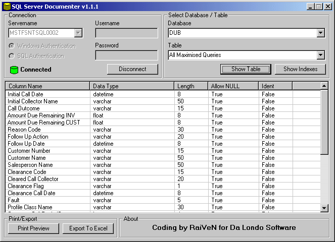



## SQL Server Documenter

### Description

SQL Server Documenter can display, print and export to Excel a complete overview of all fields and indexes in a table. This started as a "hello world" type of thing for SQL-DMO and this is the result. It's great for debugging or documenting your databases (that's why I wrote it ;-)). Try it and any suggestions are always welcome.
 
### More Info
 

             |
---                |---
**Submitted On**   |2003-07-09 12:06:02
**By**             |[RaiVeN](https://github.com/Planet-Source-Code/PSCIndex/blob/master/ByAuthor/raiven.md)
**Level**          |Advanced
**User Rating**    |5.0 (30 globes from 6 users)
**Compatibility**  |VB 6\.0
**Category**       |[Databases/ Data Access/ DAO/ ADO](https://github.com/Planet-Source-Code/PSCIndex/blob/master/ByCategory/databases-data-access-dao-ado__1-6.md)
**World**          |[Visual Basic](https://github.com/Planet-Source-Code/PSCIndex/blob/master/ByWorld/visual-basic.md)
**Archive File**   |[SQL\_Server1618467212003\.zip](https://github.com/Planet-Source-Code/raiven-sql-server-documenter__1-47082/archive/master.zip)

